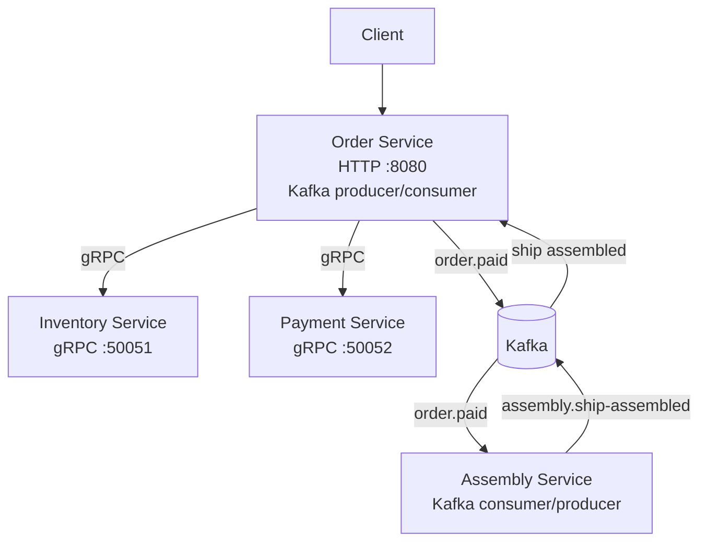

<!-- Coverage badge is auto-updated via GitHub Actions -->


<h1 align="center">🚀 My Microservices Rocket</h1>

<p align="center">
  A Go microservices platform with HTTP, gRPC, Kafka, PostgreSQL, and clean architecture.
</p>

---

## 📐 Architecture

<div align="center">



</div>

## 🔄 Event Flow

1. `Order` handles payment and publishes `order.paid` to Kafka.
2. `Assembly` consumes `order.paid`, assembles the order, and publishes `assembly.ship-assembled`.
3. `Order` consumes `assembly.ship-assembled`, commits inventory, and marks the order as assembled.

| Service       | Role                         | Protocol / Port |
|---------------|------------------------------|-----------------|
| **Order**     | HTTP API + Kafka producer/consumer + gRPC client | HTTP :8080 / gRPC :50051, :50052 |
| **Assembly**  | Kafka consumer/producer      | Kafka only      |
| **Inventory** | gRPC service                  | gRPC :50051     |
| **Payment**   | gRPC service                  | gRPC :50052     |

## 🗂️ Project Structure

```
my_microservices_rocket/
├── order/          # Order service — HTTP API + Kafka integration
├── inventory/      # Inventory service — gRPC
├── payment/        # Payment service — gRPC
├── assembly/       # Assembly service — Kafka consumer/producer
├── shared/         # Shared code: .proto definitions, OpenAPI specs, generated clients
│   ├── proto/      # Protobuf sources (buf managed)
│   └── api/        # OpenAPI specs
├── platform/       # Platform-level utilities
├── deploy/
│   └── compose/    # Docker Compose for core infra and service stacks
├── migrations/     # SQL migrations (goose)
├── go.work         # Go workspace
└── Taskfile.yaml   # All dev tasks
```

## ⚙️ Tech Stack

- **Language:** Go 1.26
- **Transport:** gRPC (`protoc-gen-go`, `protoc-gen-go-grpc`) · REST (OpenAPI via `ogen`)
- **Messaging:** Apache Kafka (KRaft mode, no ZooKeeper)
- **Database:** PostgreSQL · Migrations via `goose`
- **Testing:** `testify` · `mockery` v3 · `testcontainers` · race detector
- **Code generation:** `buf` (proto) · `ogen` (OpenAPI)
- **Linting / Formatting:** `golangci-lint` · `gofumpt` · `gci`
- **Task runner:** `task` (Taskfile)

## 🚀 Getting Started

### Prerequisites

- Go 1.26+
- Docker & Docker Compose
- [`task`](https://taskfile.dev) CLI

### 1. Install all dev tools

```bash
task setup
```

### 2. Start infrastructure (Kafka)

```bash
task up-core
```

### 3. Run services

```bash
# Each in a separate terminal
task run:inventory   # gRPC  :50051
task run:payment     # gRPC  :50052
task run:order       # HTTP  :8080
cd assembly && go run ./cmd
```

`assembly` is started from its module directly; it is not wired into `Taskfile.yaml` yet.

Or start everything with Docker Compose:

```bash
task up-all
```

### 4. Stop everything

```bash
task down-all
```

## 🧪 Testing

```bash
# Unit tests (with race detector)
task test

# Unit tests + coverage report
task test:coverage

# Open HTML coverage report
task coverage:html

# API integration tests
task test:api

# E2E tests (Postgres + Kafka via testcontainers)
task test:e2e
```

> Coverage threshold is enforced at **95%** on business logic packages.

## 🔧 Code Generation

```bash
# Generate Go code from .proto files
task proto:gen

# Generate Go code from OpenAPI specs
task ogen:gen

# Generate all (proto + openapi)
task gen

# Regenerate mocks
task mocks:gen
```

## 🗄️ Database Migrations

```bash
# Order service
task migrate:order:up
task migrate:order:down
task migrate:order:status

# Inventory service
task migrate:inventory:up
task migrate:inventory:down
task migrate:inventory:status
```

## 🧹 Code Quality

```bash
# Format code (gofumpt + gci import sorting)
task format

# Run linter
task lint

# Update all dependencies
task deps:update
```

## 🐳 Docker Compose Services

| Compose stack | Contents |
|---------------|----------|
| `core`        | Kafka (KRaft) + Kafka UI |
| `order`       | Order service + PostgreSQL |
| `inventory`   | Inventory service + PostgreSQL |

Kafka UI is available at **http://localhost:8088** (default port from `core.env`).

`payment` and `assembly` are run from source, not via Docker Compose.

## 📦 Go Workspace

The project uses a [Go workspace](https://go.dev/blog/get-familiar-with-workspaces) (`go.work`) to manage multiple modules locally without publishing them:

```
order · inventory · payment · assembly · shared · platform
```

## 📄 License

MIT © [krapagen](https://github.com/krapagen)
